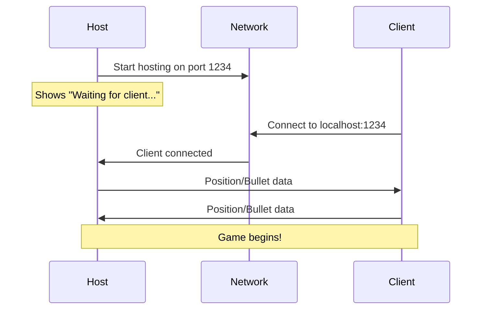
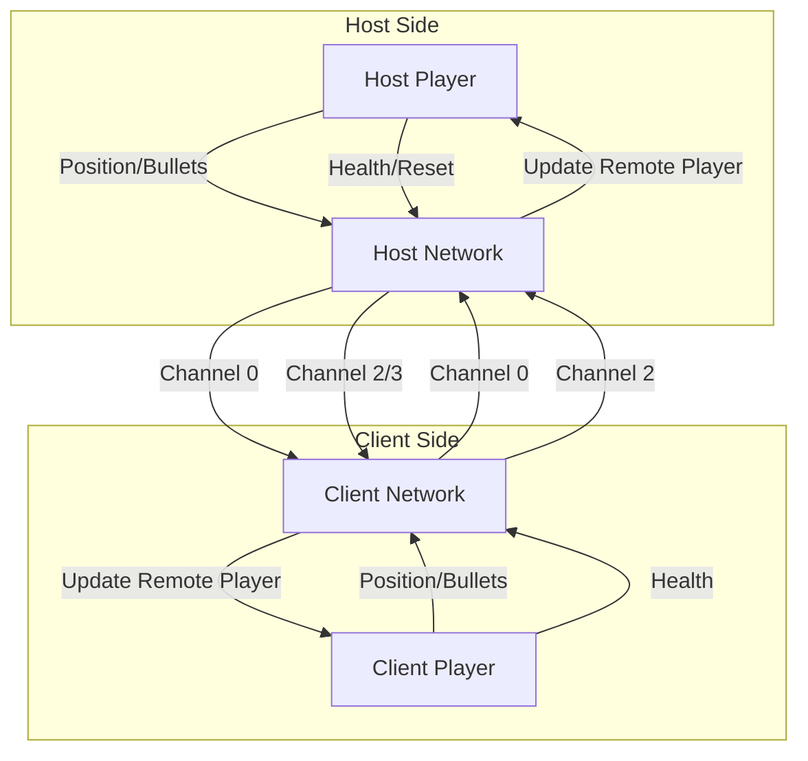

# 2D Shooter - Multiplayer Network Game

A real-time multiplayer 2D shooter game built with C++, featuring networked gameplay, obstacle collision, and cross-platform support.

  

## 🎮 Overview

This is a networked multiplayer 2D shooter where two players battle in real-time across a network connection. One player hosts the game while another connects as a client. Players must navigate around obstacles while shooting projectiles at each other until one player's health reaches zero.

## ✨ Features

- **Real-time Multiplayer**: Host/Client architecture with ENet networking
- **Obstacle System**: Dynamic map with collision detection for players and bullets
- **Health System**: Visual health bars with color-coded status indicators
- **Synchronized Gameplay**: Position, bullets, health, and game state sync across network
- **Cross-Platform**: Works on Windows, macOS, and Linux
- **Modern C++**: Built with C++17 standards and clean architecture

## 🛠️ Technical Stack

| Component | Technology | Purpose |
|-----------|------------|---------|
| **Graphics** | [Raylib](https://github.com/raysan5/raylib) | 2D rendering, input handling, window management |
| **Networking** | [ENet](https://github.com/lsalzman/enet) | UDP-based reliable networking with channels |
| **Build System** | CMake 3.20+ | Cross-platform build configuration |
| **Language** | C++17 | Core game logic and systems |

## 📋 Prerequisites

- **CMake** 3.20 or higher
- **C++17** compatible compiler:
  - GCC 7+ (Linux)
  - Clang 5+ (macOS)
  - MSVC 2019+ (Windows)
- **Git** (for submodule management)

## 🚀 Quick Start

### 1. Clone and Setup

```bash
# Clone the repository
git clone <repository-url>
cd 2d-shooter

# Initialize submodules for external libraries
git submodule update --init --recursive
```

### 2. Build the Project

#### Using the Build Script (Recommended)
```bash
# Make build script executable (Linux/macOS)
chmod +x build.sh

# Build and run host
./build.sh host

# Build and run client (in another terminal)
./build.sh client
```

#### Manual CMake Build
```bash
# Create build directory
mkdir build && cd build

# Configure and build
cmake -DCMAKE_BUILD_TYPE=Debug ..
cmake --build . --config Debug

# Run host
./debug/2d-shooter host

# Run client (in another terminal)
./debug/2d-shooter client
```

### 3. Clean Build
```bash
./build.sh clean
```

## 🎯 Game Flow

### Connection Process


### Gameplay Loop
1. **Movement Phase**: Players move using WASD keys
2. **Combat Phase**: Players shoot with SPACE key
3. **Collision Detection**: Check bullet hits and obstacle collisions
4. **Health Management**: Update and sync health across network
5. **Win Condition**: Game ends when a player's health reaches 0

### Game Over & Restart
- When any player dies, both players see game over screen
- **Host**: Can restart with 'R' key
- **Client**: Must wait for host to restart
- Reset synchronizes all players back to spawn positions with full health

## 🗺️ Map Design

The game features a strategic obstacle layout:

```
┌─────────────────────────────────────┐
│ 🔵 [Host Spawn]      [Walls]        │
│     ┌──┐                    ┌──┐    │
│     │  │     ●─────●       │  │     │
│     └──┘       ● ●         └──┘     │
│                                     │
│        ●     [Center]     ●         │
│              Obstacle               │
│                                     │
│     ┌──┐       ● ●         ┌──┐     │
│     │  │     ●─────●       │  │     │
│     └──┘                    └──┘    │
│              [Walls]   [Client] 🔴  │
└─────────────────────────────────────┘
```

**Legend:**
- 🔵 Host spawn (top-left)
- 🔴 Client spawn (bottom-right)
- `●` Circular obstacles
- `┌──┐` Rectangular obstacles
- Borders are collision walls

## 🌐 Network Architecture

### Channel Organization
The game uses ENet's channel system for message separation:

| Channel | Purpose | Data Type | Frequency |
|---------|---------|-----------|-----------|
| **0** | Position | `float[2]` | Every frame |
| **0** | Bullets | `Bullet[]` | When fired |
| **1** | Damage | `int` | On hit |
| **2** | Health | `int` | When changed |
| **3** | Reset | `int` | On restart |

### Network Message Flow


### Synchronization Strategy

The game uses a **peer-to-peer** model with **client-side prediction**:

- **Position Sync**: Each client sends their position every frame
- **Bullet Sync**: Bullets are created locally and synchronized to remote client
- **Collision Authority**: Each client detects collisions for their own bullets
- **Health Sync**: Health changes are sent immediately for display consistency

## 🏗️ Project Structure

```
2d-shooter/
├── src/
│   ├── core/
│   │   ├── constants.hpp          # Game constants
│   │   ├── game.hpp/cpp           # Main game class
│   │   └── map.hpp/cpp            # Obstacle management
│   ├── entities/
│   │   ├── bullet.hpp/cpp         # Bullet physics & serialization
│   │   ├── character.hpp          # Base character class
│   │   ├── obstacle.hpp/cpp       # Obstacle collision system
│   │   ├── player.hpp/cpp         # Player movement & combat
│   │   └── position.hpp           # Position data structure
│   ├── network/
│   │   ├── network_manager.hpp/cpp # ENet wrapper & message handling
│   │   ├── client/
│   │   │   └── client.hpp/cpp     # Client connection logic
│   │   └── server/
│   │       └── server.hpp/cpp     # Server hosting logic
│   └── main.cpp                   # Entry point
├── external/                      # Git submodules
│   ├── raylib/                    # Graphics library
│   └── enet/                      # Networking library
├── build.sh                       # Build automation script
├── CMakeLists.txt                 # Build configuration
└── README.md                      # This file
```

## 🎮 Controls

| Key | Action |
|-----|--------|
| `W` | Move Up |
| `A` | Move Left |
| `S` | Move Down |
| `D` | Move Right |
| `SPACE` | Shoot |
| `R` | Restart (Host only) |
| `ESC` | Quit |

## 🔧 Development

### Build Types
```bash
# Debug build (default)
./build.sh

# Release build
./build.sh release

# Clean build files
./build.sh clean
```

### Code Style
The project uses Google C++ style guide with modifications:
- 4-space indentation
- 140 character line limit
- Sorted includes

Format code with:
```bash
clang-format -i src/**/*.cpp src/**/*.hpp
```

### Adding New Features

1. **New Entity**: Extend from `Character` class in `entities/`
2. **Network Message**: Add new channel in `NetworkManager`
3. **Game Mechanic**: Modify `Game` class in `core/`
4. **Map Element**: Extend `Obstacle` system

## 🐛 Troubleshooting

### Common Issues

**"Failed to initialize ENet"**
- Ensure port 1234 is available
- Check firewall settings
- Try running as administrator (Windows)

**"Client can't connect"**
- Verify host is running first
- Check network connectivity
- Confirm IP address (currently localhost)

**Players not syncing**
- Check console output for network errors
- Verify both players are using same build
- Restart both host and client

**Build Failures**
```bash
# Update submodules
git submodule update --init --recursive

# Clean and rebuild
./build.sh clean
./build.sh
```

## 📈 Performance Metrics

- **Target FPS**: 60 FPS
- **Network Frequency**: ~60 messages/second per client
- **Memory Usage**: ~50MB (including graphics assets)
- **Latency**: <50ms on local network

## 🔮 Future Enhancements

- [ ] Multiple players (2+)
- [ ] Different weapon types
- [ ] Power-ups and collectibles
- [ ] Map editor
- [ ] Dedicated server mode
- [ ] Spectator mode
- [ ] Audio system
- [ ] Particle effects

## 🤝 Contributing

1. Fork the repository
2. Create feature branch (`git checkout -b feature/amazing-feature`)
3. Commit changes (`git commit -m 'Add amazing feature'`)
4. Push to branch (`git push origin feature/amazing-feature`)
5. Open Pull Request

## 📄 License

This project is open source. See the repository for license details.

## 🙏 Acknowledgments

- [Raylib](https://github.com/raysan5/raylib) - Amazing 2D graphics library
- [ENet](https://github.com/lsalzman/enet) - Reliable UDP networking
- [CMake](https://cmake.org/) - Cross-platform build system

---

**Happy Gaming! 🎮**
